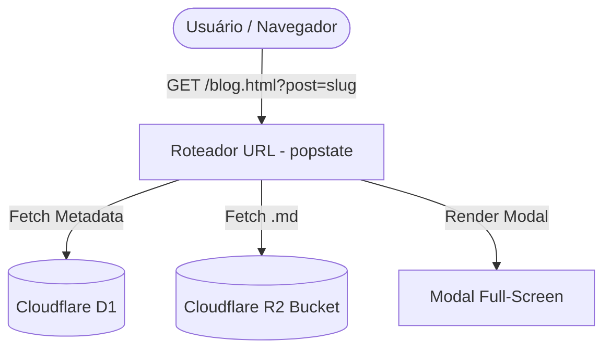

# Boas-vindas ao Blog do ARES

Bem-vindo ao espaço de artigos e publicações técnicas. Aqui compartilho conhecimentos práticos, decisões de arquitetura e soluções em engenharia de software.

## Tópicos Principais

- **Desenvolvimento Full Stack**: Node.js, React, APIs resilientes e integração de sistemas.
- **Sistemas Distribuídos**: Edge Computing (Cloudflare Workers/Pages, D1, R2), caching e banco de dados.
- **Interfaces & UX**: Design systems, animações e performance extrema.

```javascript
// Exemplo de execução modular
console.log("Blog do ARES carregado com sucesso!");
```

### Arquitetura de Comunicação



Fique à vontade para explorar os artigos e compartilhar seus feedbacks!
