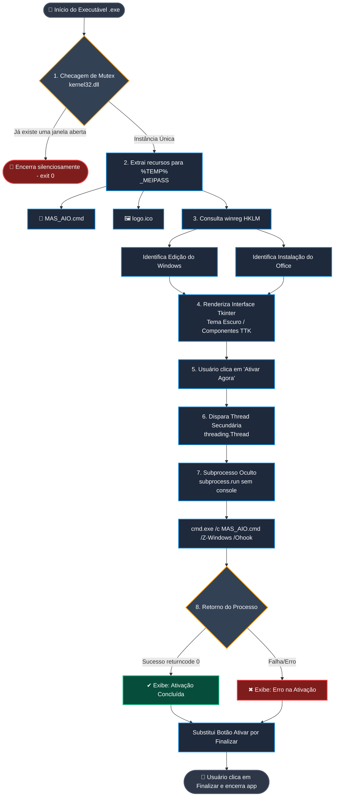

# ⚡ Zero 1 - Ativador do Sistema

Uma interface gráfica simples, leve, portátil e autossuficiente para ativação rápida do **Windows** e do **Microsoft Office**.

O projeto foi projetado especificamente para técnicos de manutenção e desenvolvedores que buscam uma solução de 1-clique sem dependências de arquivos externos e sem alertas de falso-positivo em antivírus.

---

## 📸 Demonstração


---

## ✨ Recursos

- **Portátil e Único:** Arquivo único `.exe`, sem necessidade de instalação.
- **Detecção Automática:** Identifica a versão exata do Windows e do Office instalado.
- **Execução Silenciosa:** Não abre janelas de terminal ou prompt de comando (CMD) durante o processo.
- **Elevação Automática (UAC):** Inicia solicitando permissão de Administrador automaticamente.
- **Proteção contra Múltiplas Instâncias:** Impede a abertura de mais de uma janela do aplicativo ao mesmo tempo.
- **Seguro e Sem Falsos Positivos:** Baseado em chamadas nativas do sistema e scripts de código aberto respeitados na comunidade.
- **Limpeza Automática:** Apaga quaisquer arquivos temporários ao encerrar.

---

## 🚀 Como Usar (Para Usuários)

1. Acesse a aba **[Releases](../../releases)** deste repositório.
2. Baixe o executável `Zero1-Ativador.exe`.
3. Abra o arquivo com **dois cliques** (o aplicativo solicitará a permissão de Administrador automaticamente).
4. Clique em **Ativar Agora** e aguarde a finalização do processo.
5. Clique em **Finalizar** para fechar a aplicação.

---

## 🛠️ Documentação Técnica e Arquitetura (Para DEVs)

Esta seção detalha o funcionamento interno da aplicação, as escolhas de engenharia de software e como o código lida com o sistema operacional Windows.



---

### 🏛️ Arquitetura e Decisões de Tecnologias

#### 1. Linguagem e GUI: Python 3 com Tkinter (`app.py`)

- **Por que Tkinter?** Para atingir o menor tamanho possível em disco (~10 MB compilado) e carregamento instantâneo. Bibliotecas externas como `CustomTkinter`, `PyQt` ou `PySide` arrastam dezenas de megabytes em dependências de renderização, fontes e imagens. O `Tkinter` utiliza a engine `Tcl/Tk` já presente no runtime do Python, sendo estilizado manualmente com temas escuros (`#1e1e1e`, `#252526`) e componentes `ttk` nativos.

#### 2. Empacotamento: PyInstaller (`app.spec`)

- **Single File (`--onefile`):** Compacta o código Python, os binários e os recursos estáticos (`MAS_AIO.cmd` e `logo.ico`) em um único arquivo executável estático.
- **Sem Console (`--noconsole` / `console=False`):** Desativa a criação da janela de terminal (`cmd.exe`) padrão ao abrir executáveis Python no Windows.
- **Elevação de Privilégios (`uac_admin=True`):** Injeta o manifesto UAC no binário para que o Windows solicite permissões de Administrador imediatamente ao abrir.
- **Compactação UPX (`upx=True`):** Utiliza o algoritmo UPX para reduzir o tamanho dos binários compilados em até 50%.

---

### ⚙️ Engenharia de Funcionamento Passo a Passo

```text
 [Início do Executável]
         │
         ├──► 1. Verificação de Mutex Windows (Instância Única)
         │        ├── Se existir outro processo rodando ──► [Encerra com exit(0)]
         │        └── Se for o único ──► Continua
         │
         ├──► 2. Extração para %TEMP% (_MEIPASS)
         │        ├── MAS_AIO.cmd
         │        └── logo.ico
         │
         ├──► 3. Leitura do Registro do Windows (winreg)
         │        ├── Obtém Nome do SO (HKLM\...\CurrentVersion)
         │        └── Detecta Instalação do Office (ClickToRun ou InstallRoot)
         │
         ├──► 4. Renderização da GUI (Tkinter + Event Loop)
         │
         └──► 5. Clique em "Ativar Agora"
                  └── Thread de Background (threading.Thread)
                       └── subprocess.run() roda 'MAS_AIO.cmd /Z-Windows /Ohook'
                            ├── Oculta janela (STARTF_USESHOWWINDOW + CREATE_NO_WINDOW)
                            └── Retorna sucesso (0) / falha para a Thread Principal
```
